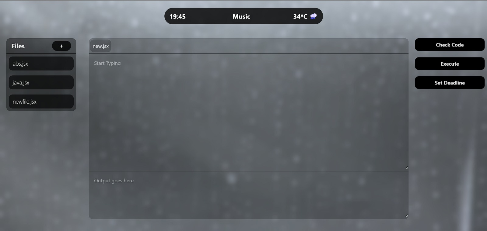

## Challenges

`Creative 404 / Error Handling `

Difficulty: Easy 

Created a creative and interactive Lost In Space 404 page that pops up either via clicking on Lost In Space in home or by entering faulty url

`Dark Mode Support`

Difficulty: Easy 

Added dark and light modes with their theme colors and gradients to make the web app more customisable and beautiful

`Custom Loading States` 

Difficulty: Easy 

Added a custom Loading state for Spotify API with an astronaut and text appearing below him

`Dynamic Theme Based on API Data` 

Difficulty: Medium 

Added the background to change as per the weather data for the user adding a sense of realism and originality

`Multilingual Support`

Difficulty: Medium 

Made the core buttons be translatable easily in common languages for user interaction

`Text-To-Speech for Content`

Difficulty: Hard 

Added a way to convert text to speech that can be used via the Welcome Message button

## Screenshot



## About

This is just a prototype, final working prototype is under development and will be introduced with sleek animations, higher workability, more options!

## Current Developements

The backend is ready with Spotify API, Weather API, and Gemini Configuration, 
whilst the weather API i under development.

The frontend is a wireframe with all the necesary details like time, weather, files, editor, output, 
whilst some changes are underway.

## Features

- Weather API integration (OpenWeatherMap)
- Calendar API integration (Google Calendar)
- AI Code Assistant (OpenAI)
- RESTful API endpoints

## Setup Instructions

1. Clone the repository
2. Create a `.env` file based on `.env.example` and fill in your API keys:
   - OpenWeatherMap API key
   - Google Calendar credentials
   - OpenAI API key

3. Install dependencies:
   ```bash
   npm install
   ```

4. Start the server:
   ```bash
   npm start
   ```

## API Endpoints

- `GET /api/weather/:location` - Get current weather for a location
- `GET /api/calendar/events` - Get next calendar events
- `POST /api/ai/analyze` - Analyze code with AI assistant

## Environment Variables

- `OPENWEATHER_API_KEY` - OpenWeatherMap API key
- `GOOGLE_API_KEY' - Gemini Key
- `PORT` - Server port (default: 3000)
- `SPOTIFY_CLIENT_SECRET` - Spotify API Key
